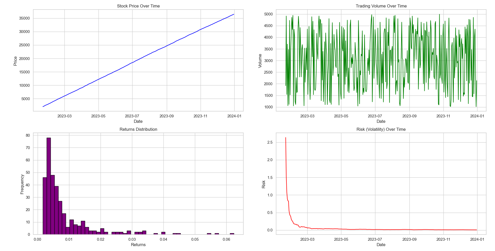

# **Stock Market Data Analysis**

## **Project Overview**

This project simulates and analyzes stock market data, focusing on stock price trends, volatility, and returns distributions. It uses Python and libraries such as **pandas**, **matplotlib**, and **seaborn** to process, clean, and visualize stock market behavior. The project generates dummy stock data, processes it through an ETL pipeline, and provides insightful visualizations to assess stock performance and financial risks.

## **Idea Description**

The main goal of this project is to analyze stock price data, specifically:

1. **Stock Price Trends**: Visualize how stock prices evolve over time, providing insights into overall market performance.
2. **Volatility**: Calculate and plot the risk (volatility) over time, helping to identify periods of high and low market risk.
3. **Returns Distribution**: Analyze and visualize stock returns, providing insights into potential risks and returns for investors.
4. **Risk Metrics**: Calculate financial risk metrics such as Value at Risk (VaR) and Conditional Value at Risk (CVaR) to assess potential financial losses.

---
## Idea implementaion

### Financial Performance Overview: Stock Price, Trading Volume, Risk, and Returns:


#### Value at Risk (95%): 0.0024
#### Conditional Value at Risk (95%): 0.0020

---
## Prerequisites

Before running the project, you need to have the following installed:

- **Python** (3.x)
- **pip** (Python package installer)

---

## **Libraries Used**

The following libraries are used in the project:

- **`pandas`**: For data manipulation and cleaning.
- **`numpy`**: For generating random numerical data (e.g., stock prices, volumes) and performing numerical operations such as calculating volatility and risk metrics.
- **`matplotlib`**: For creating static visualizations, including line plots for stock price trends, trading volume, risk (volatility), and returns distributions.
- **`seaborn`**: For creating aesthetically pleasing statistical graphics and enhancing the appearance of visualizations, particularly used for returns distributions and risk analysis.

### Installation

To install the required libraries, you can use `pip`:

```bash
pip install -r requirements.txt

```

---

## How to Run the Project

### 1. Clone the Repository (Optional)

If you haven't already, clone the repository to your local machine:

```bash
git clone https://github.com/GitEagleY/Financial_Risk_Analysis.git
cd Financial_Risk_Analysis
```
### **2. Generate Raw and Processed Data**

Run the script `generate_data.py` to generate the raw and processed stock data.

```bash
python src/generate_data.py
```

This will create the following CSV file:

- **`financial_data_before_etl.csv`**: Contains raw simulated stock market data, including stock prices, trading volume, and volatility, with some randomly generated values.

Once the raw data is generated, run `etl_data.py` to process the data and perform cleaning:

```bash
python src/etl_data.py
```

This will create the following cleaned CSV file:

- **`financial_data_after_etl.csv`**: Contains the cleaned data with calculated returns, moving averages, and volatility. Missing values are removed, and financial metrics are calculated.

---

### **3. Analyze and Visualize Data**

After generating and processing the data, you can run `analysis.py` to generate visualizations and perform the financial risk analysis:

```bash
python src/analysis.py
```

This will:
- Plot the **stock price trends** over time.
- Display the **volatility (risk)** over time as a rolling standard deviation.
- Show the **returns distribution** to visualize stock performance.
- Provide an overview of key **risk metrics** like Value at Risk (VaR) and Conditional Value at Risk (CVaR).

These visualizations and metrics will help analyze stock market behavior and assess potential financial risks.

---

## **Example Use Cases**

Here are some things you can do with the project:

1. **Stock Price Trends**:
   - See how the stock price of different companies changes over time.
   - Compare the price movements of different stocks.

2. **Volatility (Risk)**:
   - Identify periods of high or low volatility (price fluctuation) for different stocks.
   - Compare the volatility between stocks to assess their risk levels.

3. **Returns Distribution**:
   - Visualize the distribution of stock returns to understand their performance.
   - Check how the returns are spread out (e.g., are they mostly positive or negative?).

4. **Correlation Analysis**:
   - See how stocks are related to each other (e.g., do two stocks move in the same direction?).
   - Use a heatmap to identify which stocks move together.

---

## **Skills Learned**

- **Data Simulation**: How to generate realistic stock data using Python.
- **Data Cleaning**: How to clean and process stock data using `pandas`.
- **Data Visualization**: How to create charts and plots to visualize stock prices, volatility, and returns.
- **Risk Analysis**: How to assess the risk of stocks using volatility and returns.
- **Correlation Analysis**: How to understand relationships between different stocks using correlation heatmaps.

---